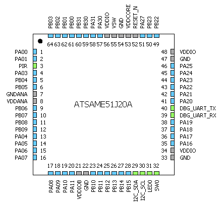

# pir_presence Overview
 * A driver for the 

# Contents Summary

| Folder              | Description                                                |
|:--------------------|:-----------------------------------------------------------|
| firmware            | embedded project source                                    |
| media               | png, etc...                                                |
| tools               | MISRA check script, etc...                                 |

# Hardware required

* Curiosity Nano Base For Click Boards
    * 
* SAME51 CNANO
    * 
* PIR Click
    * 

# IDE and compiler settings

* MPLAB X IDE v 6.05
* XC32 v4.20
* Part Packs
    * CMSIS 5.8.0
    * SAME51_DFP 3.6.130
* Harmony package versions:
    * 

# Block diagram

# Pinout

# UML class diagrams of PIR driver

# MCC Configuration Project Graph

