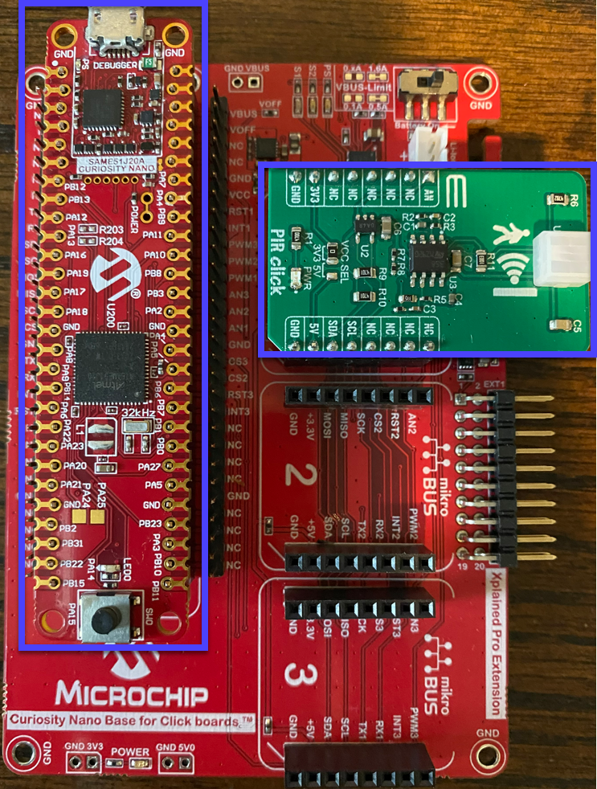
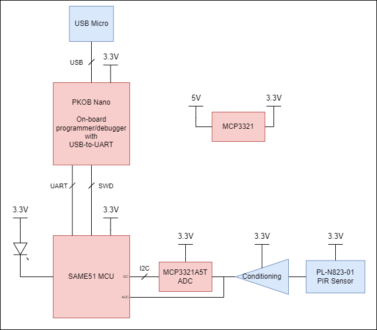
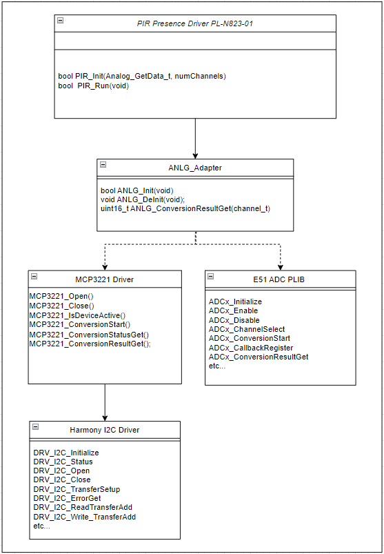

# pir_presence Overview
 * This project detects occupancy by measuring changes in the Kemet PL-823-01 pyroelectric infrared sensor. 

# Contents Summary

| Folder              | Description                                                |
|:--------------------|:-----------------------------------------------------------|
| firmware            | embedded project source                                    |
| media               | png, etc...                                                |
| tools               | MISRA check script, etc...                                 |

# Hardware Setup

* Curiosity Nano Base For Click Boards
* SAME51 CNANO
* PIR Click
* USB micro B cable
    * connect this to the SAME51 CNANO's USB connection
    * Provides debugger
    * Provides USB-to-UART prints statements from the SAME51 @ 115200 BAUD 8N1

# Block diagram

# Pinout

# MCC Configuration Project Graph

# Hardware operation

## Sensor output:

The Kemet pyroelectric infrared sensor's output sits somewhere between 650 and 680 mV at steady state. If a warm body moves closer to it, it's output rises. I have observed the output to rise to as much as ~860mV if the body approaches the sensor quickly. The output of the sensor eventually settles back to the steady state, even with the warm body directly in front of the sensor. As the warm body retracts from the sensor, the output voltage drops. I have observed the output drop to as low as 480mV if the warm body retracts quickly. 

## Gain/Filter stages: 

The sensor goes through 2 gain/filter stages producing an inverted and easily railed output. At "steady state", the voltage wanders rapidly around the 1V reference of the second gain stage. It seems as though the gain is too high as the output moves constantly from the 0-2V range. A small rise in the sensor output will cause the gain stage output to drop to ground very quickly. It will stay at ground for a short time, and then jump to 2V as the sensor output drops back to its steady state voltage. Some amount of time later, the voltage returns to it's "steady state" behavior of wandering around the reference.

## Analog to Digital Conversion:

The analog output provided by the gain/filter stages is presented in 2 ways. The first is to the Microchip MCP3221 I2C ADC. The second is to the analog pin of the click board which is routed to an native ADC capable pin on the host microcontroller. 

# Firmware Operation

The firmware will sample the conditioned signal output through one of two ADC's. Either the MCP3221 external I2C ADC or the microcontrollers internal ADC. Selection is described below. To determine occupancy, periodic samples are taken, analyzed, and compared against a fixed threshold. Since the conditioned output seems to hit both rails when a warm body approaches or retracts (described above), it is sufficient to compare against a high or low threshold. A high threshold was chosen for this project. In this test project, occupancy is indicated through the ASCII string "motion detected" printed to the serial terminal. 

## Selecting the desired ADC method

This project can use either of analog to digital conversion methods by selecting the appropriate analog adapter "c" file prior to compilation. The excluded "c" file will be greyed out while the included file will not:

To change this selection, first right-click and exclude the adapter you wish to remove, then right-click and include the adapter you wish to add, then re-building the project:

## UML class diagrams of PIR driver

## IDE and compiler settings

* MPLAB X IDE v 6.05
* XC32 v4.20
* Part Packs
    * CMSIS 5.8.0
    * SAME51_DFP 3.6.130
* Harmony package versions:
    * csp 3.16.0
    * core 3.12.0
    * dev_packs 3.16.0

# Unit Tests

* This project was created using Test Driven Development. The unit test framework selected is Ceedling which uses Unity/Cmock under the hood
    * Unit tests are executed on the X86/64 processor using the gcc compiler
    * Executing unit tests
    * 
    * 
* Code coverage is enabled in Ceedling using the gcov utility which is part of the gcc tool suite
    * Executing code coverage
    * 
    * Output is placed in the firmware\build\artifacts\gcov directory. The top level file is called "GcovCoverageResults.html". From this file you can click into the individual module reports
    * 